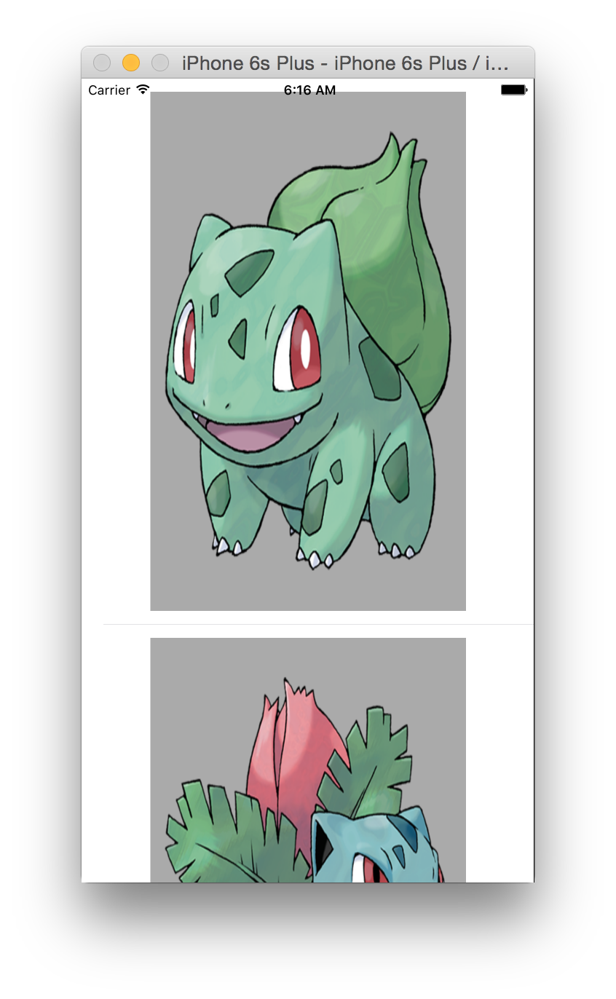

# iOS-Firebase-Pokedex

An example of loading images from base64 encoded strings using Firebase.



## Install

Dependencies managed through CocoaPods

```bash
pod install
open FirebaseStringImagesTableView.xcworkspace # didn't know what to name it at first
```

### Stackoverflow Question
[This answer is based upon this Stackoverflow question.](http://stackoverflow.com/questions/34408645/populating-tableviews-with-images-in-firebase/34418088#34418088)
